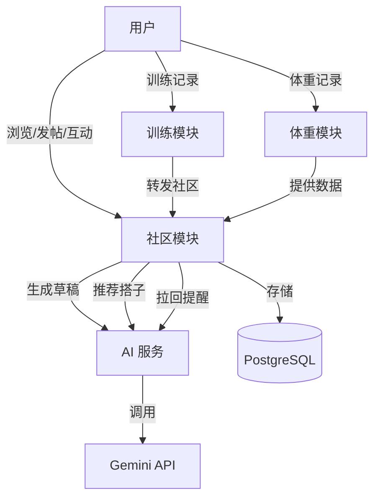
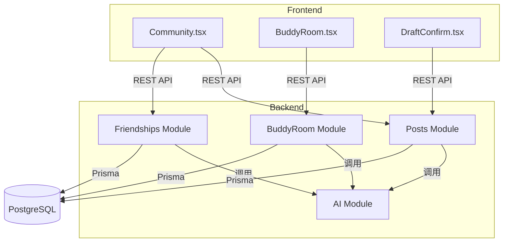
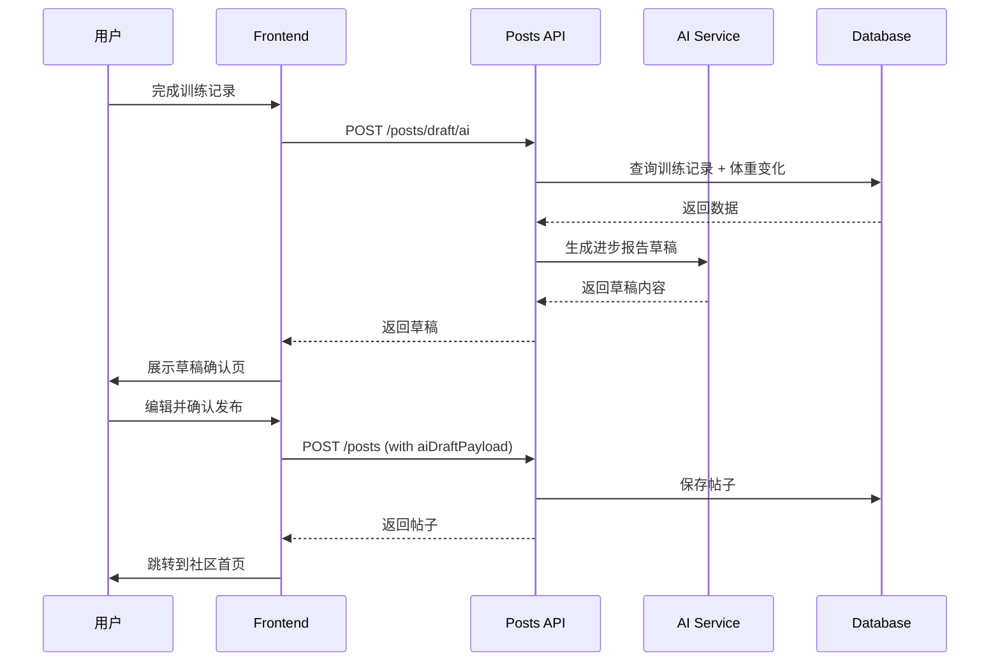
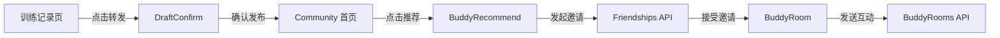
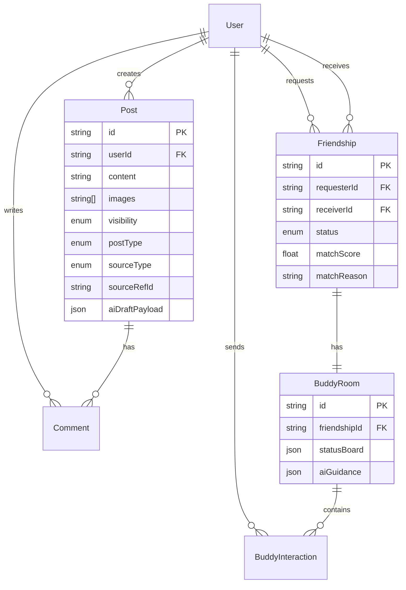

# RightNow 社区模块架构计划

**版本**: v1.0
**日期**: 2026-03-05
**状态**: 待评审
**PRD 来源**: `frontend/社区prd/社区PRD_综合版.md`

---

## 1. 业务背景与目标

### 1.1 业务定位

RightNow 社区模块是"外部驱动力系统"，补充个人目标和 AI 教练的内部驱动。核心职责：

- **晒成果**：提高用户发布阶段成果的意愿与质量
- **找搭子**：建立节奏匹配的搭子关系并持续维护
- **激励坚持**：通过 AI + 关系协作降低掉队概率

### 1.2 产品目标（按优先级）

1. **P0 - 晒成果**：用户愿意发布进步报告，社区首页持续展示可感知的进步
2. **P1 - 找搭子**：系统推荐节奏匹配的搭子，建立率与留存率达标
3. **P2 - 激励坚持**：搭子关系建立后 14 日训练完成率提升，掉队拉回率 >30%

### 1.3 非目标（MVP 不做）

- 泛兴趣话题社区
- 重聊天 IM 系统（已读回执、语音房）
- 复杂创作者体系（等级、打赏）
- 多人房间与群组机制

### 1.4 用户故事

**US-01 晒成果**：作为用户，我希望把阶段成果整理成有说服力的帖子，而不是手写长文。

**US-02 被激励**：作为用户，我希望首页看到真实进步证据，从而被激励继续执行计划。

**US-03 找搭子**：作为用户，我希望系统推荐节奏相近的搭子，而非手动盲搜。

**US-04 持续维护**：作为用户，我希望搭子关系建立后被持续维护，而不是加完好友就结束。

**US-05 训练转发**：作为用户，我希望训练记录完成后可一键转社区，并在发布前全量可编辑。

---

## 2. 架构视图

### 2.1 C4 Context 视图



### 2.2 C4 Container 视图



### 2.3 数据流图



---

## 3. 后端层设计

### 3.1 模块结构

```
backend/src/
├── posts/
│   ├── posts.module.ts
│   ├── posts.controller.ts
│   ├── posts.service.ts
│   └── dto/
│       ├── create-post.dto.ts
│       ├── create-draft.dto.ts
│       └── update-post.dto.ts
├── friendships/
│   ├── friendships.module.ts
│   ├── friendships.controller.ts
│   ├── friendships.service.ts
│   └── dto/
│       ├── request-friendship.dto.ts
│       └── recommendation-query.dto.ts
├── buddy-rooms/
│   ├── buddy-rooms.module.ts
│   ├── buddy-rooms.controller.ts
│   ├── buddy-rooms.service.ts
│   └── dto/
│       ├── interaction.dto.ts
│       └── status-update.dto.ts
└── prompts/
    └── community-prompts.ts
```

### 3.2 数据模型设计

#### 3.2.1 Post 模型扩展

```prisma
model Post {
  id        String   @id @default(cuid())
  userId    String
  user      User     @relation(fields: [userId], references: [id], onDelete: Cascade)

  content   String
  images    String[]
  tags      String[]

  // 新增字段
  visibility    PostVisibility @default(PUBLIC)  // PUBLIC | BUDDIES_ONLY
  postType      PostType       @default(NORMAL)  // NORMAL | PROGRESS_REPORT
  sourceType    SourceType?                      // MANUAL | AI_DRAFT | TRAINING_FEEDBACK
  sourceRefId   String?                          // TrainingRecord.id 或其他来源 ID
  aiDraftPayload Json?                           // 保存原始 AI 草稿用于溯源

  likedUserIds String[]
  comments     Comment[]

  createdAt DateTime @default(now())
  updatedAt DateTime @updatedAt

  @@index([userId, createdAt])
  @@index([visibility, postType, createdAt])
}

enum PostVisibility {
  PUBLIC
  BUDDIES_ONLY
}

enum PostType {
  NORMAL
  PROGRESS_REPORT
}

enum SourceType {
  MANUAL
  AI_DRAFT
  TRAINING_FEEDBACK
}
```

#### 3.2.2 Group 群聊模型（新增）

```prisma
model Group {
  id          String   @id @default(cuid())
  name        String
  avatar      String?
  description String?
  creatorId   String
  creator     User     @relation("GroupCreator", fields: [creatorId], references: [id], onDelete: Cascade)

  memberCount Int      @default(0)
  maxMembers  Int      @default(200)

  members     GroupMember[]
  messages    GroupMessage[]

  createdAt DateTime @default(now())
  updatedAt DateTime @updatedAt

  @@index([creatorId])
}

model GroupMember {
  id       String   @id @default(cuid())
  groupId  String
  group    Group    @relation(fields: [groupId], references: [id], onDelete: Cascade)
  userId   String
  user     User     @relation(fields: [userId], references: [id], onDelete: Cascade)

  role     GroupRole @default(MEMBER)  // CREATOR | ADMIN | MEMBER
  joinedAt DateTime  @default(now())

  @@unique([groupId, userId])
  @@index([userId])
  @@index([groupId])
}

model GroupMessage {
  id       String   @id @default(cuid())
  groupId  String
  group    Group    @relation(fields: [groupId], references: [id], onDelete: Cascade)
  senderId String
  sender   User     @relation(fields: [senderId], references: [id], onDelete: Cascade)

  content  String
  type     MessageType @default(TEXT)  // TEXT | IMAGE | SYSTEM

  createdAt DateTime @default(now())

  @@index([groupId, createdAt])
  @@index([senderId])
}

enum GroupRole {
  CREATOR
  ADMIN
  MEMBER
}

enum MessageType {
  TEXT
  IMAGE
  SYSTEM
}
```

#### 3.2.3 Friendship 模型扩展

```prisma
model Friendship {
  id          String   @id @default(cuid())
  requesterId String
  requester   User     @relation("FriendshipRequester", fields: [requesterId], references: [id], onDelete: Cascade)
  receiverId  String
  receiver    User     @relation("FriendshipReceiver", fields: [receiverId], references: [id], onDelete: Cascade)

  status      FriendshipStatus @default(PENDING)

  // 新增字段
  matchScore  Float?           // 匹配分数 0-100
  matchReason String?          // AI 推荐理由

  buddyRoom   BuddyRoom?

  createdAt DateTime @default(now())
  updatedAt DateTime @updatedAt

  @@unique([requesterId, receiverId])
  @@index([requesterId, status])
  @@index([receiverId, status])
}
```

### 3.3 API 端点设计

#### 3.3.1 Posts API

| 方法 | 路径 | 描述 | 权限 |
|------|------|------|------|
| GET | `/api/posts` | 获取帖子列表（支持 visibility 过滤） | JWT |
| GET | `/api/posts/:id` | 获取单个帖子详情 | JWT |
| POST | `/api/posts` | 创建帖子 | JWT |
| POST | `/api/posts/draft/ai` | 生成 AI 草稿（不落库） | JWT |
| POST | `/api/posts/from-training/:recordId` | 从训练记录生成草稿 | JWT |
| DELETE | `/api/posts/:id` | 删除帖子（仅作者） | JWT + Owner |
| POST | `/api/posts/:id/like` | 点赞/取消点赞 | JWT |
| GET | `/api/posts/:id/comments` | 获取评论列表 | JWT |
| POST | `/api/posts/:id/comments` | 添加评论 | JWT |
| DELETE | `/api/comments/:id` | 删除评论（仅作者） | JWT + Owner |

#### 3.3.2 Friendships API

| 方法 | 路径 | 描述 | 权限 |
|------|------|------|------|
| GET | `/api/friendships` | 获取搭子列表 | JWT |
| GET | `/api/friendships/recommendations` | 获取推荐搭子 | JWT |
| POST | `/api/friendships/request` | 发起搭子邀请 | JWT |
| PATCH | `/api/friendships/:id/accept` | 接受邀请 | JWT + Receiver |
| DELETE | `/api/friendships/:id` | 移除关系 | JWT + Participant |

#### 3.3.3 Groups API（新增）

| 方法 | 路径 | 描述 | 权限 |
|------|------|------|------|
| GET | `/api/groups` | 获取我的群组列表 | JWT |
| GET | `/api/groups/:id` | 获取群组详情 | JWT + Member |
| POST | `/api/groups` | 创建群组 | JWT |
| PATCH | `/api/groups/:id` | 更新群组信息 | JWT + Creator/Admin |
| DELETE | `/api/groups/:id` | 解散群组 | JWT + Creator |
| POST | `/api/groups/:id/members` | 邀请成员 | JWT + Member |
| DELETE | `/api/groups/:id/members/:userId` | 移除成员 | JWT + Creator/Admin |
| GET | `/api/groups/:id/messages` | 获取消息历史 | JWT + Member |
| POST | `/api/groups/:id/messages` | 发送消息 | JWT + Member |

### 3.4 核心业务逻辑

#### 3.4.1 AI 草稿生成逻辑

```typescript
// posts.service.ts
async generateAiDraft(userId: string): Promise<DraftResponse> {
  // 1. 查询最近 7 天训练记录
  const recentTraining = await this.prisma.trainingRecord.findMany({
    where: { userId, createdAt: { gte: sevenDaysAgo } },
    orderBy: { createdAt: 'desc' },
    take: 10,
  });

  // 2. 查询最近 30 天体重变化
  const weightRecords = await this.prisma.weightRecord.findMany({
    where: { userId, date: { gte: thirtyDaysAgo } },
    orderBy: { date: 'asc' },
  });

  // 3. 计算关键指标
  const metrics = {
    trainingCount: recentTraining.length,
    weightChange: calculateWeightChange(weightRecords),
    streak: await this.calculateStreak(userId),
  };

  // 4. 调用 AI 生成草稿
  const prompt = await this.promptService.render('community_progress_draft', {
    metrics,
    recentTraining: recentTraining.slice(0, 3),
    weightChange: metrics.weightChange,
  });

  const draft = await this.aiService.generateContent(prompt);

  return {
    content: draft.content,
    suggestedImages: [], // 可选：推荐用户最近的训练照片
    metrics,
    sourceData: { trainingIds: recentTraining.map(t => t.id) },
  };
}
```

#### 3.4.2 搭子推荐逻辑（规则匹配）

```typescript
// friendships.service.ts
async getRecommendations(userId: string): Promise<RecommendationItem[]> {
  const currentUser = await this.prisma.user.findUnique({
    where: { id: userId },
    include: { trainingRecords: { take: 30, orderBy: { createdAt: 'desc' } } },
  });

  // 1. 计算当前用户训练节奏
  const userRhythm = this.calculateTrainingRhythm(currentUser.trainingRecords);

  // 2. 查询候选用户（排除已有关系）
  const existingFriendIds = await this.getExistingFriendIds(userId);
  const candidates = await this.prisma.user.findMany({
    where: {
      id: { notIn: [userId, ...existingFriendIds] },
      status: 'ACTIVE',
    },
    include: { trainingRecords: { take: 30, orderBy: { createdAt: 'desc' } } },
    take: 50,
  });

  // 3. 计算匹配分数
  const scored = candidates.map(candidate => {
    const candidateRhythm = this.calculateTrainingRhythm(candidate.trainingRecords);

    const rhythmScore = this.compareRhythm(userRhythm, candidateRhythm); // 0-60
    const goalScore = this.compareGoal(currentUser, candidate); // 0-30
    const activityScore = this.compareActivity(currentUser, candidate); // 0-10

    const totalScore = rhythmScore + goalScore + activityScore;

    return {
      user: candidate,
      matchScore: totalScore,
      matchReason: this.generateMatchReason(rhythmScore, goalScore, activityScore),
    };
  });

  // 4. 排序并返回 Top 10
  return scored
    .sort((a, b) => b.matchScore - a.matchScore)
    .slice(0, 10);
}
```

---

## 4. 前端层设计

### 4.1 页面结构

```
frontend/views/
├── Community.tsx          # 社区首页（双标签：广场 + 搭子）
├── DraftConfirm.tsx       # AI 草稿确认页（新增）
├── BuddyRecommend.tsx     # 搭子推荐页（新增）
└── BuddyRoom.tsx          # 双人小房间（新增）

frontend/components/
├── ProgressReportCard.tsx # 进步报告卡（新增）
├── BuddyCard.tsx          # 搭子推荐卡（新增）
└── StatusBoard.tsx        # 双人状态面板（新增）
```

### 4.2 核心组件设计

#### 4.2.1 ProgressReportCard 组件

```typescript
interface ProgressReportCardProps {
  post: PostItem;
  onLike: (id: string) => void;
  onComment: (id: string) => void;
}

// 展示层级：
// 1. 主视觉（对比图或成果图）
// 2. AI 总结标题
// 3. 关键指标（体重变化、训练次数、连续天数）
// 4. 用户感受文本
// 5. 互动区（点赞、评论）
```

#### 4.2.2 DraftConfirm 页面

```typescript
interface DraftConfirmProps {
  draft: DraftResponse;
  onPublish: (editedPost: CreatePostDto) => void;
  onCancel: () => void;
}

// 功能：
// 1. 展示 AI 生成的草稿内容
// 2. 允许编辑文案、图片
// 3. 选择可见范围（全部可见 / 仅搭子可见）
// 4. 确认发布按钮
```

#### 4.2.3 BuddyRoom 页面

```typescript
interface BuddyRoomProps {
  friendshipId: string;
  onNavigate: (view: View) => void;
}

// 布局：
// 1. 顶部：StatusBoard（双方今日完成状态 + 连续天数）
// 2. 中部：AI 引导区（共同任务 / 鼓励 / 拉回提醒）
// 3. 底部：轻互动区（加油、戳一戳、预设短句）
```

### 4.3 状态管理

继续使用本地状态管理（useState），无需引入 Redux：

```typescript
// Community.tsx
const [posts, setPosts] = useState<PostItem[]>([]);
const [friendships, setFriendships] = useState<Friendship[]>([]);
const [recommendations, setRecommendations] = useState<RecommendationItem[]>([]);
const [currentTab, setCurrentTab] = useState<'forum' | 'buddies'>('forum');

// DraftConfirm.tsx
const [editedContent, setEditedContent] = useState(draft.content);
const [visibility, setVisibility] = useState<PostVisibility>('PUBLIC');
const [selectedImages, setSelectedImages] = useState<string[]>(draft.suggestedImages);

// BuddyRoom.tsx
const [roomStatus, setRoomStatus] = useState<BuddyRoomStatus | null>(null);
const [interactions, setInteractions] = useState<BuddyInteraction[]>([]);
```

### 4.4 API 集成

新增 API 客户端文件：

```typescript
// api/drafts.ts
export const draftsApi = {
  generateAi: () => client.post('/posts/draft/ai'),
  fromTraining: (recordId: string) => client.post(`/posts/from-training/${recordId}`),
};

// api/buddyRooms.ts
export const buddyRoomsApi = {
  get: (friendshipId: string) => client.get(`/buddy-rooms/${friendshipId}`),
  sendInteraction: (friendshipId: string, data: InteractionDto) =>
    client.post(`/buddy-rooms/${friendshipId}/interactions`, data),
};

// api/friendships.ts（扩展）
export const friendshipsApi = {
  // ... 现有方法
  getRecommendations: () => client.get('/friendships/recommendations'),
};
```

---

## 5. 非功能需求（NFRs）

### 5.1 性能要求

| 指标 | 目标 | 测量方式 |
|------|------|----------|
| 帖子列表加载 | P95 < 500ms | 后端日志 + 前端 Performance API |
| AI 草稿生成 | P95 < 3s | Gemini API 响应时间 |
| 搭子推荐计算 | P95 < 1s | 数据库查询 + 计算耗时 |
| 双人房间状态 | P95 < 300ms | 单表查询优化 |

### 5.2 安全要求

- **认证**：所有 API 必须通过 JWT 认证
- **授权**：帖子删除仅限作者，房间访问仅限参与者
- **数据脱敏**：用户手机号、邮箱不暴露给其他用户
- **内容审核**：MVP 阶段仅基础关键词过滤 + 人工兜底

### 5.3 可靠性要求

- **API 可用性**：>99%（排除部署窗口）
- **数据一致性**：搭子关系建立时自动创建 BuddyRoom
- **错误处理**：AI 服务失败时提供降级方案（手动发帖）

### 5.4 可维护性要求

- **测试覆盖率**：核心业务逻辑 >80%
- **代码规范**：遵循现有 NestJS + React 规范
- **文档更新**：API 变更同步更新 Swagger 文档

### 5.5 可访问性要求

- **移动端优先**：所有页面支持移动端适配
- **深色主题**：延续现有 #050505 背景 + #B8FF00 主色
- **中文 UI**：所有文案使用中文

---

## 6. 产品 Owner 行动清单

### 6.1 优先级决策（需在 Phase 1 前确认）

- [ ] 确认 MVP 可见范围简化方案（仅"全部可见"和"仅搭子可见"）
- [ ] 确认 AI 草稿数据源（训练记录 + 体重变化）
- [ ] 确认搭子推荐算法优先级（节奏 > 目标 > 活跃度）

### 6.2 资产准备

- [ ] 提供进步报告卡设计稿（或授权 AntiGravity 自主设计）
- [ ] 提供双人小房间 UI 参考（或授权 AntiGravity 自主设计）
- [ ] 提供 AI 提示词模板初稿（或由 Codex 起草后评审）

### 6.3 验收检查点

- [ ] Phase 1 结束：验收进步报告卡 + AI 草稿流
- [ ] Phase 2 结束：验收搭子推荐 + 邀请流程
- [ ] Phase 3 结束：验收双人房间 + 轻互动

---

## 7. KPIs 与监控

### 7.1 内容侧指标

| 指标 | 目标值 | 监控方式 |
|------|--------|----------|
| 进步报告帖占比 | >40% | `postType = PROGRESS_REPORT` 统计 |
| AI 草稿采纳率 | >60% | 草稿生成数 vs 发布数 |
| 训练转发率 | >20% | `sourceType = TRAINING_FEEDBACK` 统计 |

### 7.2 关系侧指标

| 指标 | 目标值 | 监控方式 |
|------|--------|----------|
| 搭子邀请接受率 | >50% | `status = ACCEPTED` / 总邀请数 |
| 搭子 7 日留存率 | >70% | 建立关系后 7 日内仍活跃 |
| 双人房间周活跃率 | >60% | 每周至少 1 次互动 |

### 7.3 坚持侧指标

| 指标 | 目标值 | 监控方式 |
|------|--------|----------|
| 建立搭子后 14 日训练完成率变化 | +15% | 对比建立前后训练频率 |
| 掉队拉回率 | >30% | 提醒后 48h 内恢复打卡 |

### 7.4 监控工具

- **后端日志**：NestJS Logger 记录关键业务事件
- **数据库查询**：定期 SQL 统计报表
- **前端埋点**：关键用户行为（发帖、邀请、互动）

---

## 8. 时间线与协作

### 8.1 Phase 1：内容闭环（1 周）

**目标**：完成"训练记录 → AI 草稿 → 发布"闭环

**AntiGravity 任务**：
- [ ] 社区首页升级（进步动态流 + 搭子推荐区占位）
- [ ] 进步报告卡组件（ProgressReportCard.tsx）
- [ ] AI 草稿确认页（DraftConfirm.tsx）
- [ ] 可见范围选择器（PUBLIC / BUDDIES_ONLY）

**Codex 任务**：
- [ ] Prisma schema 迁移（Post 模型扩展）
- [ ] `POST /posts/draft/ai` 端点实现
- [ ] `POST /posts/from-training/:recordId` 端点实现
- [ ] AI 提示词模板（`community_progress_draft`）
- [ ] 帖子列表 API 支持 visibility 过滤

**验收标准**：
- 用户可从训练记录页点击"转发社区"
- 进入草稿确认页，可编辑内容和可见范围
- 发布后在社区首页看到进步报告卡样式

---

### 8.2 Phase 2：搭子闭环（1 周）

**目标**：完成"推荐 → 建立搭子 → 进入房间"链路

**AntiGravity 任务**：
- [ ] 搭子推荐页（BuddyRecommend.tsx）
- [ ] 搭子推荐卡组件（BuddyCard.tsx）
- [ ] 社区首页搭子推荐区实现（非占位）
- [ ] 搭子列表优化（展示匹配理由）

**Codex 任务**：
- [ ] `GET /friendships/recommendations` 端点实现
- [ ] 搭子匹配算法（规则匹配：节奏 > 目标 > 活跃度）
- [ ] Friendship 模型扩展（matchScore, matchReason）
- [ ] 推荐理由生成逻辑

**验收标准**：
- 社区首页顶部可见推荐搭子入口
- 点击进入推荐页，可看到 Top 10 推荐
- 每个推荐卡展示目标、节奏、推荐理由
- 可直接发起邀请

---

### 8.3 Phase 3：关系运营闭环（1 周）

**目标**：完成双人房间 + AI 拉回提醒

**AntiGravity 任务**：
- [ ] 双人小房间页面（BuddyRoom.tsx）
- [ ] 双方状态面板组件（StatusBoard.tsx）
- [ ] AI 引导区组件（显示共同任务/鼓励/拉回）
- [ ] 轻互动区组件（加油、戳一戳、预设短句）

**Codex 任务**：
- [ ] Prisma schema 迁移（BuddyRoom + BuddyInteraction 模型）
- [ ] `GET /buddy-rooms/:friendshipId` 端点实现
- [ ] `POST /buddy-rooms/:friendshipId/interactions` 端点实现
- [ ] 房间状态计算逻辑（todayDone, streak）
- [ ] AI 拉回提醒逻辑（定时任务或手动触发）

**验收标准**：
- 搭子关系建立后可进入双人房间
- 房间顶部展示双方今日完成状态和连续天数
- 可发送轻互动（加油、戳一戳）
- AI 引导区展示共同任务或拉回提醒

---

## 9. Codex 执行清单

### Phase 1 任务

- [ ] **数据库迁移**
  - Priority: High
  - Input: 现有 Post 模型
  - Output: 扩展后的 Post schema（visibility, postType, sourceType, sourceRefId, aiDraftPayload）
  - Estimated time: 30 分钟
  - Acceptance: `npx prisma migrate dev` 成功，seed 数据正常
  - Launch: `npx prisma migrate dev --name add_post_visibility_and_source`

- [ ] **AI 草稿生成端点**
  - Priority: High
  - Input: JWT userId
  - Output: `{ content, suggestedImages, metrics, sourceData }`
  - Estimated time: 2 小时
  - Acceptance: 调用返回草稿，包含训练次数和体重变化
  - Launch: 实现 `PostsService.generateAiDraft()` + `PostsController` 路由

- [ ] **训练转发端点**
  - Priority: High
  - Input: TrainingRecord ID
  - Output: 草稿内容（基于单次训练记录）
  - Estimated time: 1 小时
  - Acceptance: 从训练记录页调用成功返回草稿
  - Launch: 实现 `POST /posts/from-training/:recordId`

- [ ] **帖子列表 visibility 过滤**
  - Priority: Medium
  - Input: `visibility` query param
  - Output: 过滤后的帖子列表
  - Estimated time: 30 分钟
  - Acceptance: `GET /posts?visibility=PUBLIC` 仅返回公开帖子
  - Launch: 修改 `PostsService.findAll()` 添加 where 条件

- [ ] **AI 提示词模板**
  - Priority: High
  - Input: 训练记录、体重变化、连续天数
  - Output: Prompt template 文件
  - Estimated time: 1 小时
  - Acceptance: 生成的草稿符合进步报告卡格式
  - Launch: 创建 `backend/src/prompts/community-prompts.ts`

### Phase 2 任务

- [ ] **搭子推荐端点**
  - Priority: High
  - Input: JWT userId
  - Output: `[{ user, matchScore, matchReason }]`
  - Estimated time: 3 小时
  - Acceptance: 返回 Top 10 推荐，按匹配分数排序
  - Launch: 实现 `FriendshipsService.getRecommendations()`

- [ ] **匹配算法实现**
  - Priority: High
  - Input: 当前用户 + 候选用户列表
  - Output: 匹配分数（0-100）
  - Estimated time: 2 小时
  - Acceptance: 节奏匹配权重 60%，目标匹配 30%，活跃度 10%
  - Launch: 实现 `calculateTrainingRhythm()`, `compareRhythm()`, `compareGoal()`

- [ ] **Friendship 模型扩展**
  - Priority: Medium
  - Input: 现有 Friendship 模型
  - Output: 添加 matchScore, matchReason 字段
  - Estimated time: 20 分钟
  - Acceptance: 迁移成功，推荐时保存匹配信息
  - Launch: `npx prisma migrate dev --name add_friendship_match_fields`

### Phase 3 任务

- [ ] **BuddyRoom 模型创建**
  - Priority: High
  - Input: Friendship 关系
  - Output: BuddyRoom + BuddyInteraction schema
  - Estimated time: 30 分钟
  - Acceptance: 迁移成功，关系建立时自动创建房间
  - Launch: `npx prisma migrate dev --name create_buddy_room`

- [ ] **房间状态端点**
  - Priority: High
  - Input: friendshipId
  - Output: `{ statusBoard, aiGuidance, interactions }`
  - Estimated time: 2 小时
  - Acceptance: 返回双方今日完成状态和连续天数
  - Launch: 实现 `BuddyRoomsService.getStatus()`

- [ ] **轻互动端点**
  - Priority: Medium
  - Input: `{ type, content }`
  - Output: 创建的 BuddyInteraction 记录
  - Estimated time: 1 小时
  - Acceptance: 发送互动后对方可见
  - Launch: 实现 `POST /buddy-rooms/:friendshipId/interactions`

- [ ] **AI 拉回提醒逻辑**
  - Priority: Medium
  - Input: 房间状态（一方掉队）
  - Output: 生成差异化提醒文案
  - Estimated time: 2 小时
  - Acceptance: 掉队方收到拉回提醒，完成方收到鼓励
  - Launch: 实现 `BuddyRoomsService.generateReminder()`

---

## 10. AntiGravity UI 执行清单

### Phase 1 任务

- [ ] **进步报告卡组件**
  - API contract: `PostItem` with `postType = PROGRESS_REPORT`
  - Constraints: 必须展示主视觉、AI 标题、关键指标、用户感受
  - Creative freedom: 卡片布局、动效、视觉层级
  - Launch: 创建 `frontend/components/ProgressReportCard.tsx`

- [ ] **AI 草稿确认页**
  - API contract: `DraftResponse` from `/posts/draft/ai`
  - Constraints: 必须支持编辑文案、图片、可见范围
  - Creative freedom: 页面布局、编辑器样式、确认流程
  - Launch: 创建 `frontend/views/DraftConfirm.tsx`

- [ ] **社区首页升级**
  - API contract: `GET /posts` with visibility filter
  - Constraints: 顶部搭子推荐区占位，主区进步动态流
  - Creative freedom: 推荐区样式、动态流布局
  - Launch: 修改 `frontend/views/Community.tsx`

- [ ] **可见范围选择器**
  - API contract: `visibility: 'PUBLIC' | 'BUDDIES_ONLY'`
  - Constraints: 两档选择，默认 PUBLIC
  - Creative freedom: 选择器样式、交互方式
  - Launch: 在 DraftConfirm 页面内实现

### Phase 2 任务

- [ ] **搭子推荐页**
  - API contract: `GET /friendships/recommendations` → `RecommendationItem[]`
  - Constraints: 展示 Top 10，支持发起邀请
  - Creative freedom: 页面布局、推荐卡样式、筛选交互
  - Launch: 创建 `frontend/views/BuddyRecommend.tsx`

- [ ] **搭子推荐卡组件**
  - API contract: `{ user, matchScore, matchReason }`
  - Constraints: 展示目标、节奏、活跃度、推荐理由
  - Creative freedom: 卡片设计、信息密度、邀请按钮样式
  - Launch: 创建 `frontend/components/BuddyCard.tsx`

- [ ] **社区首页搭子推荐区**
  - API contract: 同上
  - Constraints: 轻量展示，不抢主视觉
  - Creative freedom: 横向滚动 vs 纵向列表，展示数量
  - Launch: 在 Community.tsx 中实现

### Phase 3 任务

- [ ] **双人小房间页面**
  - API contract: `GET /buddy-rooms/:friendshipId` → `BuddyRoomStatus`
  - Constraints: 三层结构（状态面板 + AI 引导 + 轻互动）
  - Creative freedom: 整体布局、视觉层级、动效
  - Launch: 创建 `frontend/views/BuddyRoom.tsx`

- [ ] **双方状态面板组件**
  - API contract: `statusBoard: { user1, user2 }`
  - Constraints: 展示今日完成状态、连续天数
  - Creative freedom: 面板设计、对比展示方式
  - Launch: 创建 `frontend/components/StatusBoard.tsx`

- [ ] **轻互动区组件**
  - API contract: `POST /buddy-rooms/:friendshipId/interactions`
  - Constraints: 支持加油、戳一戳、预设短句
  - Creative freedom: 交互按钮设计、动效反馈
  - Launch: 在 BuddyRoom.tsx 中实现

---

## 11. 测试与责任分工

### 11.1 Test Agent 职责

- **单元测试**：核心业务逻辑（匹配算法、草稿生成、状态计算）
- **集成测试**：API 端点完整流程（创建草稿 → 发布 → 查询）
- **E2E 测试**：关键用户路径（训练转发社区、搭子邀请接受、房间互动）
- **KPI 验证**：监控指标计算逻辑正确性
- **Bug 分配**：测试失败后分配给 Codex 或 AntiGravity

### 11.2 Product Owner 职责

- **业务验收**：每个 Phase 结束后验收功能完整性
- **优先级决策**：功能冲突时决定取舍
- **周度评审**：每周检查进度和 KPI 达成情况

### 11.3 Human QA 职责

- **探索性测试**：发现边界情况和异常流程
- **UAT**：真实用户场景验收
- **UX 验证**：交互流畅度、文案准确性
- **边界情况**：极端数据（无训练记录、无搭子候选）

---

## 12. 进度追踪

### 12.1 工具推荐

- **GitHub Projects**：看板视图，按 Phase 分列
- **每日站会**：同步进度和阻塞点（可选）
- **周度报告**：KPI 达成情况 + 风险预警

### 12.2 健康仪表盘

| 维度 | 绿灯 | 黄灯 | 红灯 |
|------|------|------|------|
| 进度 | 按计划 | 延迟 1-2 天 | 延迟 >3 天 |
| 质量 | 测试通过率 >90% | 80-90% | <80% |
| KPI | 达成目标 | 达成 70-90% | <70% |

### 12.3 更新频率

- **每日**：Codex 和 AntiGravity 更新任务状态
- **每周**：Product Owner 评审进度和 KPI
- **Phase 结束**：全员验收会议

---

## 13. 风险与依赖

### 13.1 技术风险

| 风险 | 影响 | 缓解措施 |
|------|------|----------|
| Gemini API 不稳定 | AI 草稿生成失败 | 提供手动发帖降级路径 |
| 搭子推荐算法效果差 | 接受率低 | 快速迭代匹配规则，收集用户反馈 |
| 双人房间状态计算复杂 | 性能问题 | 缓存状态，定时更新而非实时计算 |

### 13.2 产品风险

| 风险 | 影响 | 缓解措施 |
|------|------|----------|
| 用户不愿发帖 | 社区冷启动失败 | 种子用户运营，AI 草稿降低门槛 |
| 搭子关系建立后不活跃 | 留存率低 | AI 拉回提醒，轻互动降低参与门槛 |
| 进步报告卡信息过载 | 用户体验差 | AntiGravity 优化信息层级 |

### 13.3 依赖项

- **训练记录模块**：必须提供"转发社区"入口（依赖 Phase 1）
- **体重记录模块**：必须提供最近 30 天数据查询（已有）
- **AI 服务**：必须支持自定义提示词模板（已有）

---

## 14. 后续演进路线图

### v1.1（MVP 后 1 个月）

- 搭子推荐 AI 增强（基于用户反馈优化匹配）
- 进步报告卡模板库（多种样式供用户选择）
- 社区内容审核优化（AI 辅助关键词过滤）

### v1.2（MVP 后 2-3 个月）

- 多人房间（3-5 人小组）
- 目标圈层可见范围（恢复"相近目标人群"）
- 社区勋章系统（连续打卡、帮助他人）

### v2.0（MVP 后 6 个月）

- 完整 IM 系统（实时聊天、语音房）
- 创作者体系（优质内容激励）
- 社区活动系统（挑战赛、打卡活动）

---

## 附录：Mermaid 图表源码

### A1. 组件交互图



### A2. 数据库 ER 图



---

**文档结束**

下一步：请 Product Owner 确认架构方案，然后启动 Codex 和 AntiGravity 并行执行。
