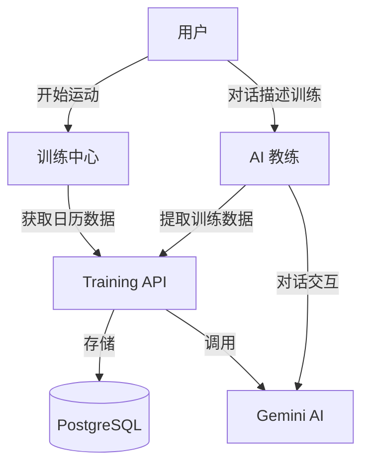
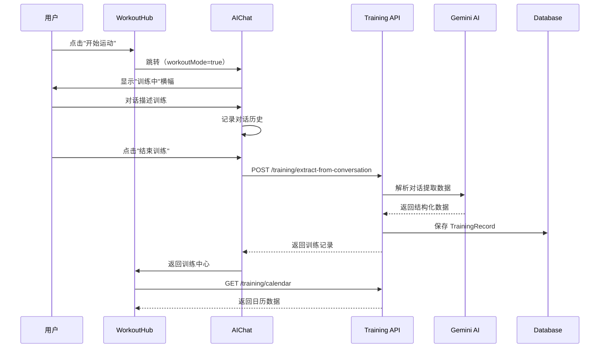

# RightNow 训练模式架构计划

**版本**: v1.0
**日期**: 2026-03-05
**状态**: 已实施（部分待完成）
**实施总结**: `docs/workout-mode-implementation-summary.md`

---

## 1. 业务背景与目标

### 1.1 业务定位

训练模式是 RightNow 的核心功能升级，将传统的"表单填写训练记录"升级为"对话式训练记录"。通过 AI 对话自然提取训练数据，降低用户记录门槛，提升记录意愿。

### 1.2 产品目标

1. **P0 - 对话式记录**：用户通过自然语言描述训练，AI 自动提取结构化数据
2. **P1 - 训练中心**：30天日历视图 + 历史记录，一站式训练管理
3. **P2 - 智能反馈**：基于训练数据生成个性化反馈和建议

### 1.3 用户故事

**US-01 启动运动**：作为用户，我希望点击"开始运动"后直接进入 AI 对话，而不是填写表单。

**US-02 对话记录**：作为用户，我希望用自然语言描述训练过程（"今天做了5组深蹲，每组10个"），AI 自动理解并记录。

**US-03 结束训练**：作为用户，我希望点击"结束训练"后，系统自动提取对话中的训练数据并保存。

**US-04 日历查看**：作为用户，我希望看到30天日历，快速了解训练频率和规律。

---

## 2. 架构视图

### 2.1 C4 Context 视图



### 2.2 数据流图



---

## 3. 后端层设计

### 3.1 数据模型扩展

```prisma
model TrainingRecord {
  id          String   @id @default(cuid())
  userId      String
  user        User     @relation(fields: [userId], references: [id], onDelete: Cascade)

  description String
  duration    Int
  date        DateTime @default(now())

  // 新增字段
  conversationId String?  // 关联的 AI 对话 ID
  workoutMode    Boolean  @default(false)  // 是否通过运动模式创建

  structuredData Json?    // AI 提取的结构化数据
  rawInput       String?  // 原始输入文本

  createdAt DateTime @default(now())
  updatedAt DateTime @updatedAt

  @@index([userId, date])
}
```

### 3.2 API 端点设计

| 方法 | 路径 | 描述 | 权限 |
|------|------|------|------|
| POST | `/api/training` | 创建训练记录（支持 conversationId, workoutMode） | JWT |
| POST | `/api/training/extract-from-conversation` | 从对话提取训练数据 | JWT |
| GET | `/api/training/calendar` | 获取日历数据（startDate, endDate） | JWT |
| GET | `/api/training` | 获取训练记录列表 | JWT |
| DELETE | `/api/training/:id` | 删除训练记录 | JWT + Owner |

### 3.3 核心业务逻辑

#### 3.3.1 对话提取逻辑

```typescript
// training.service.ts
async extractFromConversation(userId: string, messages: Message[]) {
  // 1. 构建提示词
  const prompt = `
    从以下对话中提取训练信息：
    ${messages.map(m => `${m.role}: ${m.content}`).join('\n')}

    返回 JSON 格式：
    {
      "exercises": [{ "name": "深蹲", "sets": 5, "reps": 10, "weight": 60 }],
      "duration": 45,
      "feeling": "状态不错"
    }
  `;

  // 2. 调用 Gemini AI
  const result = await this.aiService.generateContent(prompt);

  // 3. 解析并返回
  return JSON.parse(result);
}
```

#### 3.3.2 日历数据聚合

```typescript
// training.service.ts
async getCalendar(userId: string, startDate: Date, endDate: Date) {
  const records = await this.prisma.trainingRecord.findMany({
    where: {
      userId,
      date: { gte: startDate, lte: endDate }
    }
  });

  // 按日期聚合
  const calendar = {};
  records.forEach(record => {
    const dateKey = record.date.toISOString().split('T')[0];
    if (!calendar[dateKey]) {
      calendar[dateKey] = { count: 0, totalDuration: 0 };
    }
    calendar[dateKey].count++;
    calendar[dateKey].totalDuration += record.duration;
  });

  return calendar;
}
```

---

## 4. 前端层设计

### 4.1 页面结构

```
frontend/views/
├── WorkoutHub.tsx       # 训练中心（日历 + 历史记录）
└── AIChat.tsx           # AI 教练（支持运动模式）

frontend/api/
└── training.ts          # Training API 客户端
```

### 4.2 核心组件设计

#### 4.2.1 WorkoutHub 组件

```typescript
interface WorkoutHubProps {
  onNavigate: (view: View) => void;
}

// 功能：
// 1. 大的"开始运动"按钮 → 跳转到 AIChat（workoutMode=true）
// 2. 30天日历视图（标记有训练的日期）
// 3. 历史记录列表（按日期分组）
// 4. 删除记录功能
```

#### 4.2.2 AIChat 运动模式集成

```typescript
interface AIChatProps {
  workoutMode?: boolean;      // 是否为运动模式
  autoMessage?: string;       // 自动发送的消息
  onNavigate: (view: View) => void;
}

// 运动模式特性：
// 1. 显示"训练中"横幅
// 2. 显示"结束训练"按钮
// 3. 结束时调用 extractFromConversation
// 4. 保存训练记录并返回 WorkoutHub
```

### 4.3 状态管理

```typescript
// WorkoutHub.tsx
const [calendar, setCalendar] = useState<CalendarData>({});
const [records, setRecords] = useState<TrainingRecord[]>([]);
const [selectedDate, setSelectedDate] = useState<Date>(new Date());

// AIChat.tsx
const [isWorkoutMode, setIsWorkoutMode] = useState(false);
const freeChatHistoryRef = useRef<Message[]>([]);
```

### 4.4 API 集成

```typescript
// api/training.ts
export const trainingApi = {
  create: (data: CreateTrainingDto) =>
    client.post('/training', data),

  extractFromConversation: (data: { messages: Message[] }) =>
    client.post('/training/extract-from-conversation', data),

  getCalendar: (startDate: string, endDate: string) =>
    client.get(`/training/calendar?startDate=${startDate}&endDate=${endDate}`),

  list: (page: number, limit: number) =>
    client.get(`/training?page=${page}&limit=${limit}`),

  delete: (id: string) =>
    client.delete(`/training/${id}`)
};
```

---

## 5. 非功能需求（NFRs）

### 5.1 性能要求

| 指标 | 目标 | 测量方式 |
|------|------|----------|
| 对话提取 | P95 < 3s | Gemini API 响应时间 |
| 日历加载 | P95 < 500ms | 数据库查询 + 聚合 |
| 训练记录保存 | P95 < 300ms | 单表插入 |

### 5.2 安全要求

- **认证**：所有 API 必须通过 JWT 认证
- **授权**：训练记录删除仅限作者
- **数据隐私**：对话历史不永久存储，仅用于提取

### 5.3 可靠性要求

- **AI 失败降级**：提取失败时允许手动填写
- **数据一致性**：conversationId 关联确保可追溯
- **错误处理**：提取失败时提示用户并保留对话历史

---

## 6. 实施状态

### 6.1 已完成（Phase 1-3）

✅ **数据库迁移**：TrainingRecord 扩展字段
✅ **后端 API**：extract-from-conversation, calendar 端点
✅ **前端组件**：WorkoutHub 完整实现
✅ **API 客户端**：training.ts 更新

### 6.2 待完成（Phase 4）

⚠️ **AIChat 运动模式 UI**：
- 需要手动添加"训练中"横幅
- 需要手动添加"结束训练"按钮

**原因**：AIChat.tsx 文件存在字符编码问题，自动编辑困难

### 6.3 手动完成步骤

1. **运行数据库迁移**：
```bash
cd backend
npx prisma migrate dev
```

2. **添加运动模式 UI**（AIChat.tsx 约第660行）：

在 header 内添加"结束训练"按钮：
```tsx
{isWorkoutMode && (
  <button
    onClick={handleEndWorkout}
    className="px-3 py-1.5 bg-red-500/20 text-red-400 border border-red-500/30 rounded-lg text-xs font-bold"
  >
    结束训练
  </button>
)}
```

在 header 后添加横幅：
```tsx
{isWorkoutMode && (
  <div className="bg-[#B8FF00]/10 border-b border-[#B8FF00]/20 px-4 py-2 flex items-center gap-2">
    <span className="material-icons-round text-[#B8FF00] text-sm">fitness_center</span>
    <span className="text-xs text-[#B8FF00] font-bold">训练中</span>
  </div>
)}
```

---

## 7. KPIs 与监控

### 7.1 功能指标

| 指标 | 目标值 | 监控方式 |
|------|--------|----------|
| 运动模式使用率 | >40% | workoutMode=true 记录占比 |
| AI 提取成功率 | >90% | 提取成功数 / 总提取次数 |
| 日历活跃度 | >60% | 每周至少查看1次日历的用户占比 |

### 7.2 性能指标

| 指标 | 目标值 | 监控方式 |
|------|--------|----------|
| 对话提取耗时 | P95 < 3s | 后端日志 |
| 日历加载耗时 | P95 < 500ms | 前端 Performance API |

---

## 8. 测试策略

### 8.1 单元测试

- TrainingService.extractFromConversation()
- TrainingService.getCalendar()
- 日历数据聚合逻辑

### 8.2 集成测试

- POST /training/extract-from-conversation 端点
- GET /training/calendar 端点
- 完整的运动模式流程

### 8.3 E2E 测试

1. 用户点击"开始运动"
2. 进入 AI 对话界面
3. 描述训练过程
4. 点击"结束训练"
5. 验证数据提取和保存
6. 验证日历更新

---

## 9. 风险与依赖

### 9.1 技术风险

| 风险 | 影响 | 缓解措施 |
|------|------|----------|
| Gemini AI 提取不准确 | 数据质量差 | 提供手动编辑入口 |
| 对话历史过长 | 提取耗时增加 | 限制提取最近50条消息 |
| 字符编码问题 | 自动化困难 | 手动完成 UI 添加 |

### 9.2 依赖项

- **Gemini AI**：对话提取依赖 Gemini API
- **AIChat 组件**：运动模式依赖现有 AI 对话功能
- **数据库迁移**：需要先运行迁移才能使用新字段

---

## 10. 后续演进路线图

### v1.1（当前版本后1个月）

- 通过 AI 对话触发运动模式（识别"开始训练"意图）
- 训练过程中的实时数据展示
- 语音输入支持

### v1.2（当前版本后2-3个月）

- 训练记录的统计分析（周报、月报）
- 训练计划推荐
- 社交分享功能

---

## 附录：文件清单

### 已修改的文件
- `backend/prisma/schema.prisma`
- `backend/src/training/training.service.ts`
- `backend/src/training/training.controller.ts`
- `frontend/api/training.ts`
- `frontend/views/AIChat.tsx`
- `frontend/App.tsx`

### 新创建的文件
- `frontend/views/WorkoutHub.tsx`
- `backend/prisma/migrations/20260305_add_workout_mode_fields/migration.sql`

---

**文档结束**

下一步：完成 AIChat.tsx 的手动 UI 添加，然后进行完整测试。
